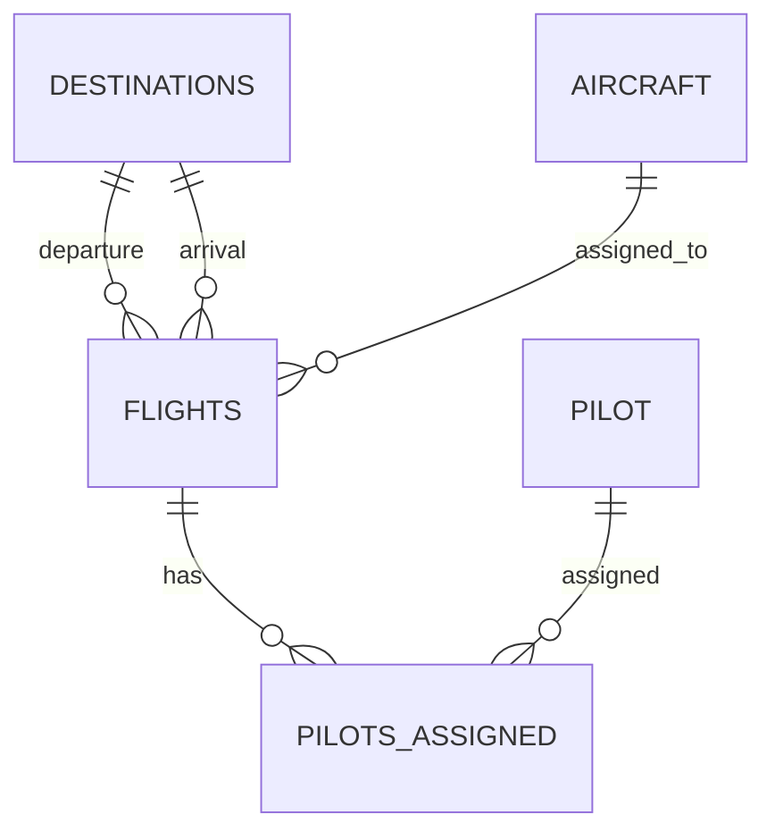

# Flight Management Database

A small Python and SQLite command-line application demonstrating **relational database design, SQL querying, CRUD operations and input validation** through a flight management system.

**Technologies:** Python · SQLite · SQL

## What I built

The application provides a simple interface for managing flights, pilots, aircraft and destinations. It supports searching and updating flights, viewing pilot schedules, assigning pilots to flights, creating and deleting flights, and checking aircraft maintenance and usage.

The project was primarily an exercise in designing a relational database and then building a Python application that could interact with it in a practical way.

## Database design

The database is built around five related tables:

| Table             | Purpose                                                             |
| ----------------- | ------------------------------------------------------------------- |
| `Flights`         | Core flight records, including times, status, airports and aircraft |
| `Destinations`    | Airport, city and country information                               |
| `Pilot`           | Pilot details, experience and contact information                   |
| `Pilots_Assigned` | Links pilots to flights and stores their role                       |
| `Aircraft`        | Aircraft details, capacity, mileage and inspection dates            |

`Flights` acts as the central table, linking to destinations, aircraft and pilot assignments.

A key design challenge was representing both the departure and arrival airport for each flight. The application solves this by joining `Destinations` twice with SQL aliases, allowing both airports to be displayed clearly.



## SQL and application functionality

The Python application uses SQL for both querying and modifying the database.

### Querying

Examples include:

* Searching flights by departure time range, destination or aircraft
* Viewing a pilot's schedule
* Joining flight and destination data to display readable airport and city information
* Ordering pilots by experience
* Calculating aircraft usage with `COUNT`, `GROUP BY` and `LEFT JOIN`

For example, aircraft usage is calculated while retaining aircraft that have not yet been used:

```sql
SELECT Aircraft.Aircraft_ID, Aircraft.Model_No,
       COUNT(Flights.Flight_ID) AS FlightCount
FROM Aircraft
LEFT JOIN Flights
    ON Aircraft.Aircraft_ID = Flights.Aircraft_ID
GROUP BY Aircraft.Aircraft_ID;
```

### Updating data

The application supports CRUD-style workflows for flights and pilot assignments:

* **Create:** add flights and pilot assignments
* **Read:** search and display flight, pilot and aircraft information
* **Update:** change flight status, destinations and inspection dates
* **Delete:** remove flights and their associated pilot assignments

When creating a flight, the program inserts the new flight first, obtains its generated `Flight_ID`, and then uses that ID to create the related pilot-assignment records.

## Validation and robustness

Reusable validation functions handle common input and reference checks throughout the application.

The application:

* Checks that referenced IDs exist before using them
* Validates date and time formats
* Prevents invalid pilot IDs, invalid roles and duplicate pilot-flight assignments
* Checks conditions such as arrival and departure being different and arrival occurring after departure
* Uses parameterised `?` placeholders for user-supplied SQL values

The repeated validation logic was refactored into shared functions, keeping the application more consistent and reducing duplicated code.

## Example workflow

Creating a flight brings the database design and application logic together:

```text
Select airports
      ↓
Validate inputs
      ↓
Enter flight times
      ↓
Select aircraft
      ↓
Assign Captain + Co-Pilot
      ↓
INSERT into Flights
      ↓
Get new Flight_ID
      ↓
INSERT pilot assignments
      ↓
Commit changes
```

## Project structure

```text
Flight_Management_Database/
├── Flight_Management.py       # Command-line application and SQL operations
├── Database_Creation.py        # Creates and seeds the SQLite database
├── Flight_Management.db       # Sample SQLite database
└── FlightManagement_Document.pdf
```

## Running the application

No external Python packages are required.

```bash
python Flight_Management.py
```

The repository includes a sample database, so the application can be explored immediately. To create a fresh seeded database, close the application, remove or rename the existing `Flight_Management.db`, and run:

```bash
python Database_Creation.py
```

The creation script expects the database file not to exist yet, so do not run it against the included database without first removing or renaming that file.

## Detailed documentation

The full project report is included in the repository as `FlightManagement_Document.pdf`.
